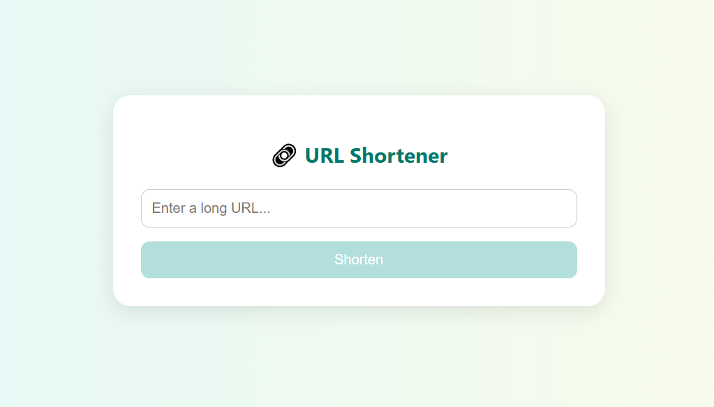

# Url Shortener Client
## A Modern Web Application for url shortening
A modern and responsive frontend for a URL shortening service, featuring real-time statistics, clipboard interaction, and visual charts.

Screenshots


Features
Shorten Long URLs: Enter any valid long URL and get a shortened version instantly

Copy to Clipboard: One-click copy button to grab the short URL

View URL Statistics: Unique visits per day displayed in a bar chart. Top 10 visitor IPs displayed in a pie chart

Loading Indicators: Visual feedback using spinners during API calls.

Toast Notifications: Informative success and error messages for user actions.

To start a local development server, type in the terminal:

```bash
npm run start
```

Once the server is running, your browser will automatically open

## Running unit tests

To execute unit tests, type in the terminal
```bash
npm run test
```
